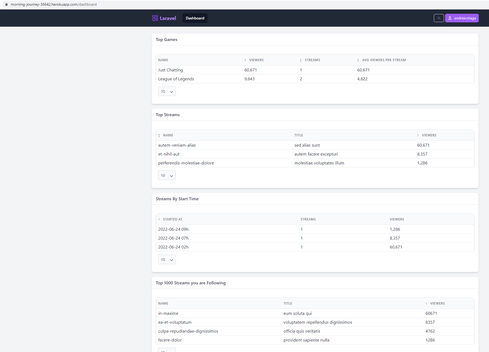
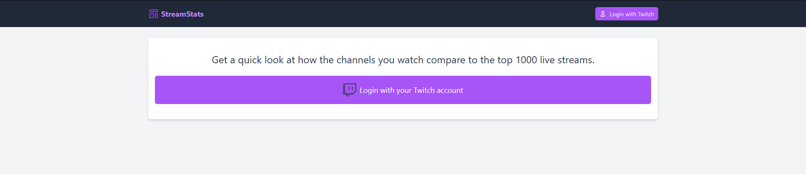
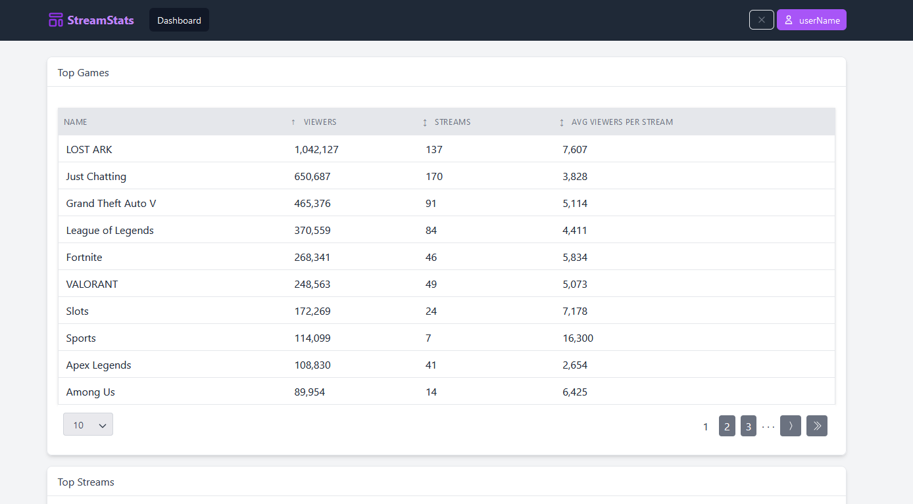
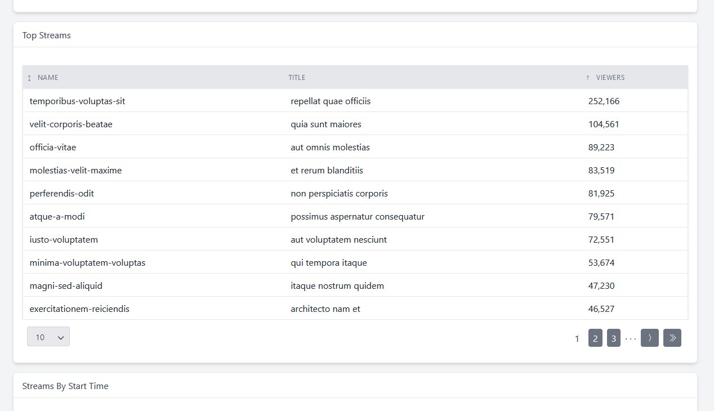
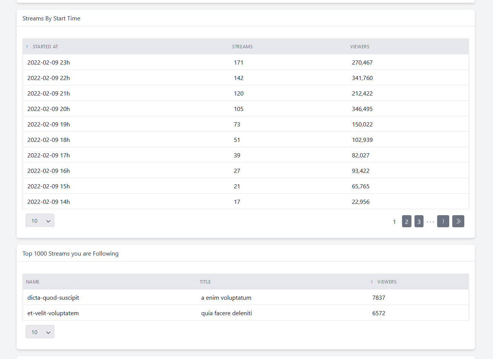
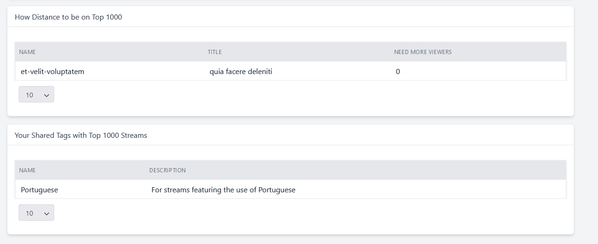

## Stream Stats

Simple web application using Oauth through Twitch for showing user's streaming following compared to top streaming.

## Configurations

| Parameter            | Type    | Default | Info                          |
|----------------------|---------|---------|-------------------------------|
| TWITCH_CLIENT_ID     | string  | null    | Get From Twitch API account   |
| TWITCH_CLIENT_SECRET | string  | null    | Get From Twitch API account   |
| SHUFFLE_STREAMS      | boolean | true    | Shuffle stream data on import |

## Print Screens

